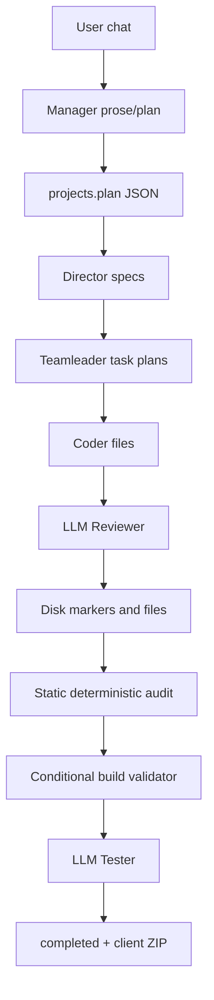
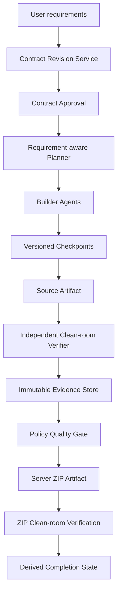
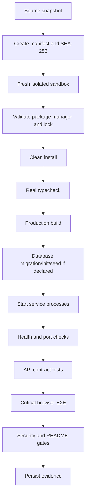

# Project Quality Improvement Plan

> Status: Analysis and architecture proposal only. No pipeline, agent, test, or generated-project code is changed by this document.

## Source Evidence

This plan treats the following as primary evidence:

- `project-out-sandbox/todo-app/taslak-analiz.md`
- `project-out-sandbox/todo-app/sonuc-raporu.md`
- `backend/data/projects.db` records for `project-f2226560-c4b5-4147-a7b5-aeb9f7df95fb`
- `projects/project-f2226560-c4b5-4147-a7b5-aeb9f7df95fb/`
- Current orchestration, agent, validation, state, ZIP, and test implementation

Observed facts:

- User revision requested Nuxt 3, Vue 3, Composition API, and Pinia; persisted plan and artifact remained Next.js/React.
- Artifact had no Todo or Category model, Todo CRUD API, Todo UI, filters, search, priority, due date, or statistics.
- Clean `npm install` failed with `ETARGET` for `class-variance-authority@^1.0.0`.
- No lock file or test script existed.
- Frontend, backend, database, build, and runtime verification did not succeed.
- The system nevertheless persisted `status=completed` and emitted “Onaylandı (Kusursuz)”.

---

## 1. Executive Summary

The todo artifact failed because product completion is currently inferred from orchestration progress, file presence, shallow static checks, and an LLM Tester verdict—not from an approved requirement contract and executable evidence.

Primary systemic causes:

1. **Requirement revision loss:** `pending_approval` is excluded from the plan-persistence branch in `backend/routes/projectRoutes.js:331-349`; the Nuxt revision remained chat text while the old Next plan remained canonical.
2. **Unsupported stack silently defaults:** `backend/engine/codeGenerator.js:296-350` recognizes Next/Vite/Express heuristics but not Nuxt/Vue; unmatched frontend projects default to Next.
3. **No product contract or traceability:** agent schemas carry prose, domains, tasks, and files but no stable requirement IDs, supersession, mandatory feature list, or requirement-to-evidence links.
4. **Weak checkpoint semantics:** `backend/engine/fileProtocol.js:218-247` accepts task reports/status markers plus non-empty files as completion. Tester rejection does not invalidate those checkpoints; final resume skipped all 16 tasks.
5. **Quality gate is not executable acceptance:** dependency install, lock integrity, real typecheck, runtime, API behavior, UI behavior, E2E, and ZIP clean-room validation are absent or optional.
6. **Static checks prove consistency, not product completeness:** existing deterministic audit checks present JSON, syntax, imports, declared packages, optional Prisma consistency, and non-empty files; it cannot prove required domain entities or workflows exist.
7. **Dependency generation guesses versions:** unknown imported packages receive `^1.0.0` in `backend/engine/codeGenerator.js:441-450`; side-effect imports such as `import 'dotenv/config'` are missed.
8. **Workflow and product completion are conflated:** Tester rejection returns without changing the attempt’s default `terminalStatus='completed'`; an LLM approval path later sets the project to `completed` and generates an unsupported “Kusursuz” claim.

Decision: replace prose-driven completion with a versioned `PROJECT_CONTRACT`, requirement traceability, immutable verification evidence, an independent clean-room Verifier, fail-closed gates, and derived completion state. LLM agents may propose or review work; they cannot create authoritative PASS evidence.

Success criterion for this initiative:

> A new artifact cannot become downloadable as verified or enter `completed` unless its latest approved contract revision is fully traced to source, tests, runtime behavior, and a clean-room validation of the exact ZIP delivered to the user.

---

## 2. Failure Categories

| Category | Todo evidence | System-level failure | Required prevention |
| --- | --- | --- | --- |
| Requirement/contract drift | Nuxt/Vue/Pinia request produced Next/React | Chat revision was not persisted; no approved versioned contract | Versioned contract, supersession, approval gate, unsupported-stack failure |
| Core product omission | No Todo/Category/CRUD/UI | Tasks are not required to cover mandatory requirements | Stable requirement IDs, traceability matrix, core coverage gate |
| Skeleton false positive | Generic API/login/button/input present | Files and scaffolds substitute for behavior | Placeholder/dead-flow analysis plus behavioral evidence |
| Template contamination | Rental Fleet/Rent a Car text in todo project | No domain vocabulary or template-origin check | Domain contamination gate |
| Dependency failure | Invalid `class-variance-authority` version; missing `dotenv` | Guessed versions; side-effect import missed; install not executed | Registry/lock validation, AST imports, clean install gate |
| Build/type false positive | Broken named export not detected | Regex heuristic presented as typecheck; build skipped without `node_modules` | Real framework typecheck and build in sandbox |
| Runtime architecture failure | Frontend/backend never started; same default port | No service/process contract or health verification | Service manifest, port/base-URL/CORS checks, startup gate |
| API/UI behavior omission | No Todo endpoints or user journey | Route/component presence is treated as feature evidence | Real HTTP and browser journeys with persistence assertions |
| Test infrastructure absence | No test script or tests | Test presence is not mandatory | Contract-derived minimum test standard |
| Artifact mismatch risk | Client creates ZIP from file JSON and excludes lock files | Delivered ZIP is never independently validated | Server artifact manifest, hash, extract-and-test clean room |
| Security baseline gap | Unrestricted CORS; fake auth UI | Security is not contract-aware or mandatory | Applicable security baseline and real auth flow rules |
| Completion/state false positive | Rejected run recorded completed; final “Kusursuz” | Workflow completion and product acceptance share semantics | Separate state machines and evidence-derived completion |
| Observability gap | No successful Tester record/raw decision | PASS claims lack immutable command/output evidence | Gate run/evidence records and evidence-based report |

---

## 3. Root Causes

### 3.1 Requirement revision was not canonical

**Evidence**

- Chat row 373 contains the Nuxt 3 revision.
- Persisted `projects.plan` still contains Next.js.
- `backend/routes/projectRoutes.js:331-349` permits plan replacement only from `planning`, `completed`, or `paused`; revision happened during `pending_approval`.
- `backend/engine/workflow.js:240-265` correctly uses the persisted plan, so downstream agents received the wrong canonical input.

**Root cause**

Chat content and approved project contract are not separate versioned concepts. A natural-language response can claim a revision without a durable contract revision being created and approved.

**System correction**

Introduce immutable contract revisions. Any requirement-bearing user message creates a draft revision; conflicting previous requirements become `superseded`. Coding may consume only an explicitly approved revision ID and hash.

**Verification**

Route-level integration test: while project is `pending_approval`, submit a Nuxt revision, assert contract revision increments, old frontend requirement is superseded, approval references new hash, and no Next scaffold is generated.

### 3.2 Stack selection is permissive and unsupported stacks silently mutate

**Evidence**

`backend/engine/codeGenerator.js:296-350` has Next/Vite/Express detection and defaults unmatched non-Express projects to Next.

**Root cause**

Stack inference is heuristic and has no contract-conformance or capability registry.

**System correction**

Add an explicit supported-stack registry. Contract validation must resolve every selected framework to a supported adapter. Unsupported framework means `contract_blocked`, never fallback.

**Verification**

- Nuxt contract resolves only to Nuxt adapter.
- Missing Nuxt adapter returns deterministic `UNSUPPORTED_STACK`.
- No generated dependency or file may contradict contract framework identifiers.

### 3.3 Agent plans do not carry requirement identity

**Evidence**

- Manager schema: summary/talimatname/domains (`backend/agents/schemas.js:260-311`).
- Director schema: domain/altTalimatname/teamleaders (`:312-374`).
- Teamleader tasks: id/title/description/dependencies/targetFiles (`:376-446`).
- Coder output: files/summary only (`:448-460`).

**Root cause**

Requirements are prose. There is no stable identity connecting user demand → contract → task → code → test → runtime evidence.

**System correction**

Require `requirementIds` on domains, tasks, generated files, reviewer decisions, verifier checks, and artifacts. Planning validation rejects missing/unknown/duplicate requirement references.

**Verification**

Schema tests and end-to-end planning tests reject task plans that do not cover every mandatory requirement exactly through at least one implementation task and one verification task.

### 3.4 Project-level rejection does not invalidate task checkpoints

**Evidence**

- Tester rejection paused the project at logs 161–163.
- `isTaskCompleted` only checks `RAPOR.md`/`TAMAMLANDI` and target file existence/size.
- Resume logs 167–182 skipped all 16 tasks in about 1.3 seconds.
- Existing test `backend/tests/test_deep_verification.js:216-220` explicitly treats a report alone as completion.

**Root cause**

Checkpoint identity has no contract revision, task spec hash, input dependency hash, target content hash, gate version, or rejection state.

**System correction**

Checkpoint key:

```text
contractRevision + planHash + taskSpecHash + inputDependencyHash + targetContentHash + qualityGateVersion
```

Tester failures persist affected requirement IDs and invalidate matching checkpoints. Resume consumes durable repair issues, not chat prose.

**Verification**

Reject a completed task at product gate, resume, and assert only affected tasks reopen; stale marker files cannot cause skip.

### 3.5 Dependency validation checks names, not resolvability

**Evidence**

- Unknown imports get `^1.0.0` (`backend/engine/codeGenerator.js:441-450`).
- Deterministic audit checks package name declaration, not registry existence or peer compatibility (`backend/agents/tester.js:728-796`).
- Import regex misses `import 'dotenv/config'`.
- Clean install was never a completion prerequisite.

**Root cause**

Dependency generation and verification are static manifest operations, not a package-resolution transaction.

**System correction**

Use AST import inventory, supported package/version policy, registry resolution, peer dependency validation, package-manager selection, lock generation, and clean install. Remove generic version fallback.

**Verification**

Invalid version, missing side-effect dependency, peer conflict, package-manager/lock mismatch, and absent lock each produce deterministic FAIL.

### 3.6 Build gate passes without performing a build

**Evidence**

- `backend/engine/buildValidator.js:544-617` runs build only when `node_modules` exists.
- Missing `node_modules` creates `framework_build: skipped` without failure.
- `backend/tests/test_build_sandbox_gate.js:81-103` deliberately expects `passed=true` in this case.
- Fallback TypeScript validator is a heuristic scan, not `tsc` (`buildValidator.js:306-365`).

**Root cause**

“Not run” is modeled as non-failure. Gate success means “no detected issue” rather than “required verification executed and passed”.

**System correction**

Every gate has `PASS | FAIL | BLOCKED | NOT_APPLICABLE`; mandatory `BLOCKED`/missing evidence blocks completion. Real typecheck and build commands run inside a sandbox after clean install.

**Verification**

No dependencies, no typecheck command, sandbox unavailable, timeout, non-zero exit, or missing build script must all prevent completion when applicable.

### 3.7 Product semantics rely on LLM approval

**Evidence**

`workflow.js:618-635` forces rejection for existing deterministic/build failures, but semantic requirements are only prompt context. A later LLM Tester approval can authorize completion. Successful raw Tester decision is not persisted.

**Root cause**

LLM review is treated as authoritative acceptance while deterministic checks omit product semantics.

**System correction**

LLM Tester becomes advisory. Independent Verifier aggregates machine evidence. `approved` is derived by policy, never accepted from agent output.

**Verification**

Inject `approved:true` from every agent while a mandatory machine gate fails; aggregate remains FAIL and completion transition is rejected.

### 3.8 Workflow attempt and product state are conflated

**Evidence**

- `workflow.js:225-227` initializes `terminalStatus='completed'`.
- Tester rejection pauses project and returns without changing it.
- `finally` persists the attempt using that terminal status.
- Attempt ending with Tester error log 163 is recorded `completed`.

**Root cause**

Workflow execution status, implementation status, verification status, and product status are represented by overlapping strings and uncontrolled writes.

**System correction**

Separate state machines; transition through repository commands with invariants/CAS. Project `completed` is derived from immutable evidence, not directly writable by agents or workflow branches.

**Verification**

State-transition tests reject illegal transitions, rejection records `rejected`, and concurrent/stale writers cannot overwrite a newer contract or verification state.

---

## 4. Current Pipeline Weaknesses

### 4.1 Current flow



Weak boundaries:

| Boundary | Current behavior | Failure mode |
| --- | --- | --- |
| Chat → plan | Keyword/state-gated replacement | Latest requirement can remain chat-only |
| Plan → scaffold | Heuristic stack inference | Unsupported stack mutates silently |
| Plan → tasks | Prose and domains only | Core requirements omitted |
| Task → completion | Marker + non-empty target | Skeleton or rejected code is reusable |
| Imports → dependencies | Regex + guessed versions | Invalid/missing packages |
| Source → type/build | Heuristic/conditional commands | Never-run gates can pass |
| Tester → acceptance | LLM boolean | Self-report controls product state |
| Source → ZIP | Browser JSZip from file API | Lock excluded; exact artifact unverified |
| Workflow → completed | Direct status write | Workflow finish equals product finish |
| Completion → report | Generic prose | No reproducible evidence |

### 4.2 Current tests preserve false-positive behavior

- Plan readiness test copies keyword logic rather than exercising the actual pending-approval route.
- Build sandbox test explicitly allows missing `node_modules` to pass.
- Task completion tests accept report markers without semantic verification.
- E2E simulation fabricates Reviewer/Tester approvals rather than requiring process evidence.
- Agent schema tests validate old fields but not requirement identity/evidence.

### 4.3 ZIP path is not an artifact pipeline

`frontend/src/App.jsx:425-447` builds ZIP client-side. `backend/routes/projectRoutes.js:193-250` returns source file contents and excludes lock files. There is no immutable artifact ID, server-side manifest, SHA-256, clean-room extraction, validation result, or verified-download policy.

---

## 5. Required Architectural Changes

### 5.1 Target architecture



### 5.2 Proposed focused modules

| Module | Responsibility | Existing integration |
| --- | --- | --- |
| `backend/contracts/projectContract.js` | Contract schema, revision normalization, capability validation | Replaces prose-only plan authority in chat/workflow |
| `backend/contracts/traceability.js` | Requirement/task/code/test/evidence graph and coverage policy | Consumed by planner and verifier |
| `backend/contracts/domainPolicy.js` | Required entity/screen/API/flow extraction and contamination vocabulary | Feeds deterministic gates |
| `backend/repositories/projectContractRepository.js` | Versioned contracts and supersession | SQLite migrations in `backend/db.js` |
| `backend/repositories/verificationRepository.js` | Immutable verification runs/checks/evidence/repair issues | Replaces logs as authoritative evidence |
| `backend/repositories/artifactRepository.js` | Artifact manifest/hash/status/run linkage | Used by download API |
| `backend/verification/packageVerifier.js` | Import inventory, registry/version/peer/lock/install | Replaces guessed dependency acceptance |
| `backend/verification/sandboxRunner.js` | OS-enforced unprivileged execution, mounts, network/resource policy, teardown | Required boundary for every generated-code command |
| `backend/verification/processVerifier.js` | Sandboxed process start, readiness, timeout, cleanup | Runs only through `sandboxRunner` |
| `backend/verification/buildVerifier.js` | Real typecheck/build/database commands | Evolves `buildValidator.js`; runs only through `sandboxRunner` |
| `backend/verification/apiVerifier.js` | Contract-derived HTTP behavior checks | Uses service manifest |
| `backend/verification/browserVerifier.js` | Critical user journeys and persistence | Independent browser runner inside verifier network boundary |
| `backend/verification/smokeVerifier.js` | Contract-derived minimum startup/core-journey smoke gate | Produces a mandatory gate independent of full E2E |
| `backend/verification/testInfrastructureVerifier.js` | Required scripts, test levels, fixtures, and framework adapter commands | Blocks projects with no executable test contract |
| `backend/verification/securityVerifier.js` | Contract-aware security baseline | Results are evidence, not prose |
| `backend/verification/readmeVerifier.js` | README command/script/env/port consistency | Runs in clean room where safe |
| `backend/verification/artifactVerifier.js` | ZIP manifest, traversal, extraction, clean install/build/runtime/E2E | Runs before artifact becomes verified |
| `backend/verification/qualityPolicy.js` | Gate applicability and aggregate decision | Sole authority for acceptance |
| `backend/engine/checkpoints.js` | Versioned task checkpoint calculation/invalidation | Replaces marker-only skip decision |
| `backend/engine/stateMachine.js` | Workflow/product/verification/artifact transitions | Removes lifecycle rules from auth module |

Keep `backend/auth.js` responsible for authentication/authorization only. Keep routes as command/query adapters; do not embed state or quality policy in routes.

### 5.3 Persistence model

Additive migration first; legacy JSON remains read-only during migration, then remove dual authority after cutover.

#### `project_contracts`

```text
id, project_id, revision, status,
contract_json, contract_hash,
source_message_id, supersedes_revision,
approved_at, created_at
UNIQUE(project_id, revision)
```

Contract status: `draft | pending_approval | approved | superseded | rejected`.

#### Contract-scoped requirement graph

```text
requirements(
  id, contract_id, stable_key, statement,
  kind, priority, mandatory, source_message_id,
  status, supersedes_requirement_id,
  UNIQUE(contract_id, stable_key),
  UNIQUE(contract_id, id)
)

contract_elements(
  id, contract_id, element_type, stable_key, spec_json,
  UNIQUE(contract_id, stable_key),
  UNIQUE(contract_id, id)
)

contract_tasks(
  id, contract_id, stable_key, task_spec_json,
  UNIQUE(contract_id, stable_key),
  UNIQUE(contract_id, id)
)
```

Use typed links rather than an unconstrained polymorphic `link_type/link_id`:

```text
requirement_task_links(contract_id, requirement_id, task_id)
requirement_element_links(contract_id, requirement_id, element_id)
requirement_file_links(contract_id, requirement_id, artifact_id, path)
requirement_check_links(contract_id, requirement_id, verification_check_id)
requirement_artifact_links(contract_id, requirement_id, artifact_id)
```

Every link has composite foreign keys proving both objects belong to the same `contract_id`; evidence from an older contract or another project cannot satisfy current coverage. `requirement_file_links` has composite foreign keys to both `requirements(contract_id, id)` and immutable `artifact_files(contract_id, artifact_id, path)`. At least one current-contract file link is mandatory before the traceability matrix’s Code/entity cell can PASS.

#### `verification_runs`

```text
id, project_id, contract_id, source_artifact_id,
status, policy_version, started_at, ended_at,
UNIQUE(contract_id, id)
```

#### `verification_checks`

```text
id, contract_id, run_id, gate_name, applicability,
status, command, cwd, exit_code,
started_at, ended_at, timed_out,
stdout_digest, stderr_digest, evidence_json,
UNIQUE(contract_id, id),
FOREIGN KEY(contract_id, run_id)
  REFERENCES verification_runs(contract_id, id)
```

#### `repair_issues`

```text
id, project_id, contract_id, run_id,
requirement_id, fingerprint, severity,
status, detail_json, created_at, resolved_at
```

#### `artifacts` and immutable files

```text
artifacts(
  id, project_id, contract_id, kind,
  path, sha256, size, manifest_json,
  status, verification_run_id, created_at,
  UNIQUE(contract_id, id)
)

artifact_files(
  contract_id, artifact_id, path, sha256, size,
  PRIMARY KEY(contract_id, artifact_id, path),
  FOREIGN KEY(contract_id, artifact_id)
    REFERENCES artifacts(contract_id, id)
)
```

#### `task_checkpoints`

```text
task_checkpoints(
  project_id, task_id, contract_id,
  plan_hash, task_spec_hash, input_hash,
  output_hash, gate_version,
  status, revision, created_at, invalidated_at,
  PRIMARY KEY(
    project_id, task_id, contract_id,
    plan_hash, task_spec_hash, input_hash,
    output_hash, gate_version
  )
)
```

Checkpoint invalidation targets the full primary key and current `revision` in one compare-and-swap update; no broad marker lookup or duplicate row may remain valid for the same identity. Use foreign keys, status CHECK constraints, indexes on project/status/version, and compare-and-swap revision checks. Avoid storing canonical gate state only inside opaque `workflow_state` JSON.

### 5.4 `PROJECT_CONTRACT`

Minimum canonical shape:

```json
{
  "schemaVersion": 1,
  "projectId": "project-id",
  "revision": 3,
  "status": "approved",
  "purpose": "Task management application",
  "applicationType": "full-stack-web",
  "frontend": {
    "framework": "nuxt",
    "frameworkVersion": "3",
    "language": "typescript",
    "ui": "tailwind",
    "stateManagement": "pinia"
  },
  "backend": {
    "framework": "express",
    "language": "typescript",
    "process": "separate"
  },
  "database": { "engine": "sqlite", "orm": "prisma" },
  "authentication": { "required": false },
  "domainEntities": [
    {
      "name": "Todo",
      "requiredFields": ["id", "title", "description", "completed", "priority", "dueDate", "categoryId"]
    },
    {
      "name": "Category",
      "requiredFields": ["id", "name"]
    }
  ],
  "requiredEndpoints": [
    "GET /api/todos",
    "POST /api/todos",
    "PUT /api/todos/:id",
    "DELETE /api/todos/:id",
    "GET /api/categories",
    "POST /api/categories",
    "PUT /api/categories/:id",
    "DELETE /api/categories/:id",
    "GET /api/stats"
  ],
  "requiredScreens": [
    { "id": "todo.dashboard", "responsive": true },
    { "id": "todo.editor", "responsive": true },
    { "id": "category.manager", "responsive": true }
  ],
  "requiredFlows": [
    "todo.list",
    "todo.create",
    "todo.edit",
    "todo.complete",
    "todo.delete",
    "todo.filter.status",
    "todo.filter.priority",
    "todo.filter.category",
    "todo.search",
    "todo.persist",
    "category.manage",
    "stats.view"
  ],
  "requiredFeatures": [
    "todo.description",
    "todo.dueDate",
    "todo.priority",
    "category.tags",
    "responsive.layout",
    "theme.lightDark",
    "ui.transitions"
  ],
  "deployment": { "target": "local", "containerRequired": false },
  "tests": {
    "unit": true,
    "integration": true,
    "api": true,
    "smoke": true,
    "criticalE2E": true
  },
  "requirements": [
    {
      "id": "REQ-TODO-CREATE",
      "statement": "User can create a Todo with description, priority, due date, and category",
      "mandatory": true,
      "priority": "core",
      "sourceMessageId": 373
    },
    {
      "id": "REQ-TODO-LIFECYCLE",
      "statement": "User can list, edit, complete, filter, search, persist, and delete Todos",
      "mandatory": true,
      "priority": "core",
      "sourceMessageId": 373
    },
    {
      "id": "REQ-CATEGORY-MANAGE",
      "statement": "User can create, update, filter by, and delete categories",
      "mandatory": true,
      "priority": "core",
      "sourceMessageId": 373
    },
    {
      "id": "REQ-STATS",
      "statement": "User can view total, completion, and upcoming-due-date statistics",
      "mandatory": true,
      "priority": "core",
      "sourceMessageId": 373
    },
    {
      "id": "REQ-UX",
      "statement": "Required screens are responsive and provide declared theme and transition behavior",
      "mandatory": true,
      "priority": "supporting",
      "sourceMessageId": 373
    }
  ]
}
```

Rules:

- Only latest `approved` revision enters workflow.
- Each execution snapshots `contract_id` and `contract_hash`.
- New requirement message creates draft revision; prior conflict becomes superseded.
- Approval is invalid if capability registry cannot implement exact stack.
- Agents may not replace technologies; proposed change creates a new draft requiring user approval.

### 5.5 Domain, placeholder, and contamination gates

**Domain gate**

- Derive expected entities and behavior from contract.
- Inspect ORM/schema/types/routes and runtime API behavior.
- Required entity absent → FAIL.
- Entity exists but unused by required API/UI → FAIL traceability.

**Placeholder/skeleton gate**

Flag but do not count as feature evidence:

- Empty controller/handler
- Constant success response
- Mock/fake-only data path
- Form without reachable backend
- Link to absent route
- Helper with no production callsite
- UI component with no user-flow evidence
- `TODO`/`FIXME`/throw-not-implemented
- Test that only asserts source text/file presence

**Template contamination gate**

- Build allowed vocabulary from contract entities, title, brand, routes, screens, and fixtures.
- Scan metadata, visible strings, routes, models, env, README, seeds, and tests.
- Known template origin terms outside contract produce FAIL unless explicitly allowlisted with rationale.

### 5.6 Scope and implementation order

Planner policy:

```text
CORE REQUIREMENTS
> REQUIRED SUPPORTING FEATURES
> OPTIONAL ENHANCEMENTS
```

Required implementation order:

1. Final contract
2. Architecture/service manifest
3. Domain model
4. Database
5. Core backend
6. Core frontend
7. Integration
8. Secondary features
9. Tests
10. Clean install/type/build
11. Runtime
12. Acceptance
13. ZIP artifact validation
14. Completed

No optional auth, theme, analytics, or design-system work may satisfy core coverage or run ahead of uncovered mandatory requirements unless it is a dependency of a core flow.

---

## 6. Agent Instruction Changes

| Role | Current weakness | Required instruction/schema change | Proof required |
| --- | --- | --- | --- |
| Manager | Produces prose plan; chat claim can differ from persisted plan | Emit `PROJECT_CONTRACT` draft with revision, source message IDs, stable requirement IDs, supersession; never claim persistence before repository acknowledgement | Persisted contract ID/hash and approval state |
| Director/Planner | Domain tasks need not cover mandatory features | Consume exact contract hash; map every teamleader mission to requirement IDs; reject uncovered mandatory requirements | Coverage report with zero mandatory gaps |
| Teamleader | Tasks contain files but no acceptance/evidence contract | Add `requirementIds`, `priority`, `core`, `acceptanceCriteria`, `verificationTasks`; core-first DAG validation | Validated task-to-requirement graph |
| Coder | Files/summary can be self-reported complete | Output files plus requirement IDs and implementation notes; cannot set completion; cannot emit files outside task target allowlist without approved scope change | Safe writes and checkpoint candidate only |
| Reviewer | LLM `approved` is trusted | Review contract/task diff, callsites, domain contamination, placeholder behavior; output findings only; no authoritative PASS | Findings linked to requirement/file; machine gates remain authority |
| Tester | Prompt/static manifest can authorize product | Split advisory QA from independent Verifier; Tester may propose scenarios/findings but cannot set acceptance state | Scenario definitions and findings, not PASS |
| Verifier (new) | Absent | Must be independent of Builder context; test exact artifact in clean sandbox; persist commands, exit codes, HTTP/browser/DB evidence | Immutable verification run and checks |
| Manager completion reporter | Emits “Kusursuz” from boolean | Render only quality-policy aggregate and evidence references; banned unsupported superlatives | Evidence-based completion report |

Prompt/schema changes must be applied to both fallback prompt source and synchronized `docs/*.md`; `backend/tests/test_docs_agent_sync.js` must continue enforcing equality.

Additional agent invariants:

- Unknown requirement ID → reject response.
- Duplicate or fabricated requirement → reject response.
- Agent output cannot change framework/package manager/database without a new contract revision.
- Repair output is restricted to affected requirement/task targets.
- Reviewer/Tester self-report never creates gate evidence.
- Optional enhancement tasks are blocked while mandatory traceability has gaps.

---

## 7. Quality Gate Redesign

### 7.1 Gate result model

```text
PASS            Required check ran and succeeded with evidence.
FAIL            Check ran and failed.
BLOCKED         Check could not run; mandatory gate remains unsatisfied.
NOT_APPLICABLE  Contract/policy says check does not apply; reason required.
```

`SKIPPED` is an execution event, not a successful gate result. A mandatory skipped check resolves to `BLOCKED`.

### 7.2 Minimum policy

| Gate | Applicability | PASS evidence | Failure/block condition |
| --- | --- | --- | --- |
| `contract_check` | Always | Approved contract ID/hash; no conflict; supported stack | Missing/unapproved/unsupported contract |
| `requirement_traceability` | Always | Every mandatory requirement linked through implementation and verification | Any mandatory gap |
| `domain_entity_check` | Domain projects | Expected entities/fields/relations plus runtime use | Missing or disconnected entity |
| `placeholder_check` | Always | No core flow represented only by stub/mock/dead UI | Placeholder in required flow |
| `template_contamination` | Always | No unapproved external-domain markers | Old template/brand/entity evidence |
| `dependency_resolution` | Package projects | Every import resolved to valid compatible package/version | Unknown/missing/invalid/peer conflict |
| `lockfile` | Package projects | Package-manager-matching lock hash | Missing/mismatched lock |
| `clean_install` | Package projects | Clean sandbox command exit 0 | Non-zero/timeout/not run |
| `lint` | Policy-enabled source | Configured command exit 0 | Missing required script/non-zero |
| `typecheck` | Typed projects | Real framework typecheck exit 0 | Heuristic-only/not run/non-zero |
| `build` | Buildable projects | Real build exit 0 | Missing script/runner/non-zero/not run |
| `database` | DB projects | Migration/init/connection evidence | Migration/connection failure |
| `backend_start` | Backend service | Process ready and health HTTP success | Exit/timeout/health failure |
| `frontend_start` | Frontend service | HTTP 200 and browser load | Exit/timeout/console fatal |
| `port_process_contract` | Multi-service | Unique ports, valid API URL/proxy/CORS/env/start commands | Conflict or unreachable dependency |
| `api_smoke` | API requirements | Real requests, schema/status/DB effect | Missing/wrong behavior |
| `test_infrastructure` | Always | Required framework-adapter scripts, test levels, isolated fixtures, and critical-journey tests exist and are executable | Missing script/adapter/fixture/journey test or not run |
| `smoke` | Executable products | `smokeVerifier` starts every service and completes the contract-derived core journey with HTTP/browser/database/process/cleanup evidence | Runner/scenario/evidence missing, any step fails, timeout, mocked persistence, or not run |
| `critical_e2e` | UI products | Contract-derived browser journeys | Any mandatory journey failure |
| `security_baseline` | Web/API products | Applicable checks pass; exceptions approved | Critical/high baseline failure |
| `readme_validation` | Deliverables | Commands/scripts/env/ports match and safe commands execute | Documentation drift |
| `artifact_validation` | Downloadable product | Exact ZIP hash passes clean-room chain | ZIP differs or any clean-room gate fails |

### 7.3 Aggregate policy

```text
QUALITY_GATE = PASS
iff
all mandatory gates == PASS
and all mandatory requirements == PASS
and artifact verification references exact downloadable SHA-256
```

Rules:

- Agent approval cannot change a gate result.
- Deterministic FAIL cannot be overridden by LLM output.
- Missing runner or missing dependency is BLOCKED/FAIL, never PASS.
- Repair loops create a new verification run; prior evidence remains immutable.
- Quality policy version is stored with each run.

### 7.4 Security baseline

Contract-aware checks:

- Unrestricted CORS
- Secret/API key and committed `.env`
- Authentication and authorization completeness when required
- Fake auth UI when auth is not implemented
- CSRF for cookie-authenticated unsafe operations
- Rate limiting for exposed auth/sensitive endpoints
- XSS and unsafe HTML sinks
- Injection and dynamic execution
- Unsafe production error output
- Dependency audit and lock integrity

Authentication not requested: do not generate it as an optional distraction. Authentication requested: login UI alone cannot pass; backend credential/session/token flow, authorization, negative tests, and runtime evidence are mandatory.

---

## 8. Completion State Redesign

### 8.1 Separate state machines

**Product state**

```text
planning
→ pending_approval
→ contract_approved
→ implementing
→ implementation_finished
→ verification_pending
→ verification_running
→ acceptance_verified
→ artifact_verified
→ completed
```

Failure branches:

```text
verification_running → verification_failed
implementing → paused
any active state → failed/aborted where policy permits
```

**Workflow run state**

```text
queued | running | paused | rejected | failed | aborted | finished
```

**Artifact state**

```text
draft | built | verification_pending | verified | rejected | superseded
```

### 8.2 Completion invariant

`completed` is derived and not directly settable by agents/routes:

```text
implementation_finished = true
build_verified = true
runtime_verified = true
acceptance_verified = true
artifact_verified = true
mandatory_requirements_passed = true
contract_id = latest_approved_contract_id
artifact.contract_id = contract_id
verification.policy_version = active_policy_version
```

### 8.3 Transition authority

- Routes request commands; repository/state-machine validates transition.
- Workflow engine may mark implementation/workflow stages, not product acceptance.
- Quality policy may mark acceptance verified from evidence.
- Artifact verifier may mark exact artifact verified.
- Completion projector derives `completed` transactionally.
- Compare-and-swap revision prevents stale workflow writes.

### 8.4 Rejection semantics

Tester/Verifier rejection must:

1. Set workflow run `rejected` or `failed`, never `completed`.
2. Set product `verification_failed`.
3. Persist requirement-linked repair issues.
4. Invalidate affected checkpoints.
5. Prevent download-as-verified and completion.
6. Preserve failed evidence for audit.

Safety delivery rule: the first rejection-state change must also implement coarse invalidation of **all** checkpoints for that contract revision. Selective requirement-linked reuse may ship later, but marker-only checkpoints must never survive a rejection during the transition period.

---

## 9. Verification Pipeline

### 9.1 Clean-room source verification



No existing `node_modules`, build output, DB, cache, or temporary files are reused.

“Fresh directory” is not a security boundary. `sandboxRunner` must refuse execution unless an OS-enforced isolation adapter is available. Minimum policy:

- Run under an unprivileged, dedicated execution identity with no access to the XFactor process environment, backend database, user home, repository root, SSH material, or service credentials.
- Mount the source snapshot read-only and one disposable workspace writable; expose no host paths outside explicit allowlists.
- Allow network only to configured package registries during dependency installation; disable external network during build/runtime tests unless the approved contract explicitly requires an allowlisted service. Keep generated services on an isolated loopback network.
- Enforce CPU, memory, disk, process-count, output-size, and wall-clock limits; kill the complete process tree and destroy the workspace after every run.
- Use a container, VM, or platform sandbox with equivalent kernel/OS enforcement. Windows implementation must use a restricted token plus Job Object/container/isolated worker boundary; a child process with scrubbed environment alone is insufficient.
- Sandbox unavailable or policy setup failure resolves every mandatory executable gate to `BLOCKED`, never host fallback.

### 9.2 Service manifest

Each process declares:

```json
{
  "id": "backend",
  "command": ["npm", "run", "start:backend"],
  "port": 4000,
  "healthUrl": "http://127.0.0.1:4000/health",
  "dependsOn": ["database"],
  "startupTimeoutMs": 30000,
  "environment": ["DATABASE_URL", "PORT"]
}
```

Verifier checks unique ports, base URLs, proxy/CORS, required env, readiness, fatal console/process output, and cleanup.

### 9.3 API verification

For each contract endpoint:

- Send real HTTP request.
- Validate status and response schema.
- Validate negative/error behavior.
- Validate database state change or non-change.
- Link evidence to requirement ID.

A route file or regex match is discovery evidence only, never behavior PASS.

### 9.4 UI behavior verification

Contract-derived Todo critical journey example:

1. Open application.
2. Create Todo.
3. Observe it in list.
4. Edit it.
5. Mark completed.
6. Filter and search.
7. Reload and verify persistence.
8. Delete it.
9. Verify database/API/UI agree.

Feature PASS requires successful UI interaction, API result, persistence, and visible state—not component presence.

### 9.5 Mandatory smoke gate

`backend/verification/smokeVerifier.js` owns a distinct, mandatory smoke gate. Canonical invocation:

```text
node backend/verification/verificationCli.js smoke --run-id <verification_run_id>
```

The framework adapter derives the smallest end-to-end scenario from mandatory contract requirements. For a Todo product it must start all declared services, open the frontend, create one Todo, read it through API and UI, reload to prove persistence, mutate it, delete it, and re-check database/API/UI agreement. PASS evidence contains scenario ID, requirement IDs, service/artifact hashes, step timestamps, HTTP status/response digests, browser assertion results, database assertion digests, process exit/readiness data, and cleanup result. Missing scenario, unstarted service, mocked persistence, failed cleanup, timeout, or any failed step is FAIL/BLOCKED and prevents completion.

### 9.6 Minimum test infrastructure

`backend/verification/testInfrastructureVerifier.js` resolves framework-adapter commands and requires:

- A test script recognized by the selected package manager/framework.
- Unit tests for non-trivial domain logic where applicable.
- API/integration tests for persistence and contracts.
- Critical E2E for mandatory user journeys.
- Deterministic isolated fixtures and cleanup.

Canonical policy invocation:

```text
node backend/verification/verificationCli.js test-infrastructure --run-id <verification_run_id>
```

A missing mandatory script, adapter command, fixture isolation contract, or critical-journey test makes the gate BLOCKED/FAIL.

### 9.7 ZIP artifact validation

Current client-side ZIP path is replaced by a server artifact pipeline:

```text
verified source snapshot
→ server ZIP creation
→ ZIP manifest + SHA-256
→ new sandbox
→ extract with traversal/size checks
→ assert lock/config/source manifest
→ clean install
→ typecheck/build
→ database/runtime/API/E2E
→ artifact status verified
→ expose download
```

The exact hash tested is the exact hash downloaded. Any artifact mutation creates a new artifact ID and requires a new verification run.

### 9.8 README validation

- Parse documented commands, scripts, ports, env files, migrations, seed, and URLs.
- Confirm referenced scripts/config/files exist.
- Execute safe setup commands as part of clean-room sequence.
- Compare documented service manifest with canonical contract.
- A README seed command without a supported seed implementation fails.

---

## 10. Requirement Traceability

### 10.1 Trace model

```text
User message
→ Contract revision
→ Requirement
→ Architecture/domain element
→ Task
→ Source files
→ Automated tests
→ Runtime evidence
→ ZIP artifact evidence
```

### 10.2 Required matrix

| Requirement ID | Requirement | Code/entity | API | UI | Automated test | Runtime evidence | Artifact evidence | Result |
| --- | --- | --- | --- | --- | --- | --- | --- | --- |
| `todo.create` | Create Todo | Todo model/service | POST `/api/todos` | Create form | API + E2E | HTTP/DB/browser evidence | ZIP run evidence | PASS/FAIL |
| `todo.edit` | Edit Todo | Update service | PUT `/api/todos/:id` | Edit control | API + E2E | HTTP/DB/browser evidence | ZIP run evidence | PASS/FAIL |
| `todo.delete` | Delete Todo | Delete service | DELETE `/api/todos/:id` | Delete control | API + E2E | HTTP/DB/browser evidence | ZIP run evidence | PASS/FAIL |
| `todo.filter` | Filter/search | Query/filter logic | GET query contract | Filter/search controls | Unit + E2E | Browser evidence | ZIP run evidence | PASS/FAIL |
| `todo.persist` | Reload persistence | Todo schema/repository | GET `/api/todos` | Reloaded list | Integration + E2E | DB/browser evidence | ZIP run evidence | PASS/FAIL |
| `category.manage` | Category support | Category model/service | Category API | Category controls | API + E2E | HTTP/DB/browser evidence | ZIP run evidence | PASS/FAIL |
| `todo.stats` | Statistics | Aggregate logic | GET `/api/stats` | Stats widget | Unit/API/E2E | HTTP/browser evidence | ZIP run evidence | PASS/FAIL |

Row result policy:

- Mandatory cell missing → FAIL.
- Applicable evidence `NOT_RUN`/`BLOCKED` → row not PASS.
- Mock-only evidence → FAIL for production behavior.
- File/component existence → discovery only.
- Requirement superseded → excluded only when linked to approved replacement revision.

### 10.3 Definition of Done

Generate `DEFINITION_OF_DONE.md` as a human-readable projection of canonical contract and gate records:

```text
[ ] Approved framework matches generated stack
[ ] Main domain models exist and are exercised
[ ] Required API endpoints pass behavior tests
[ ] Required screens and journeys pass E2E
[ ] Clean dependency install passes
[ ] Lock file validated
[ ] Real typecheck passes
[ ] Production build passes
[ ] Database initialization passes
[ ] Frontend/backend runtime health passes
[ ] Security baseline passes
[ ] README commands match reality
[ ] Exact ZIP passes clean-room verification
```

Checkboxes cannot be edited to authorize completion; they render from evidence.

### 10.4 Evidence-based completion report

Replace unsupported prose with:

```text
Contract: revision 4 / hash abc123
Requirements: 18/18 PASS
Dependency install: PASS / evidence ev-101
Lock integrity: PASS / evidence ev-102
Typecheck: PASS / evidence ev-103
Build: PASS / evidence ev-104
Database: PASS / evidence ev-105
Backend startup: PASS / evidence ev-106
Frontend startup: PASS / evidence ev-107
API tests: 12/12 PASS / evidence ev-108
Critical E2E: 6/6 PASS / evidence ev-109
Security baseline: PASS / evidence ev-110
README validation: PASS / evidence ev-111
ZIP clean-room: PASS / artifact sha256 ... / evidence ev-112
```

Each PASS links to immutable check data: command/scenario, exit/status, timestamps, output digests, and artifact/requirement IDs.

---

## 11. Regression Prevention

### 11.1 Contract and planning tests

| Regression | Test target | Expected result |
| --- | --- | --- |
| Revision during `pending_approval` | Project chat route integration | New contract revision persists and requires approval |
| Conflicting framework revision | Contract repository/schema | Old requirement becomes superseded |
| Unsupported Nuxt adapter | Capability validation | Deterministic `UNSUPPORTED_STACK`; no Next fallback |
| Missing mandatory requirement coverage | Director/Teamleader schema | Plan rejected before coding |
| Optional work before core coverage | DAG policy | Optional task blocked/reordered |
| Unknown/fabricated requirement ID | Agent parser | Response rejected |

### 11.2 Checkpoint/workflow tests

| Regression | Test target | Expected result |
| --- | --- | --- |
| Tester rejection after task marker | Checkpoint service | Affected checkpoint invalidated |
| Resume after contract change | Workflow integration | Old checkpoints/caches not reused |
| Rejected run terminal state | Workflow attempt repository | `rejected`, never `completed` |
| Stale concurrent save | Repository CAS | Conflict; newer state preserved |
| Quality policy version change | Checkpoint calculation | Reverification required |

### 11.3 Verification tests

| Regression | Expected result |
| --- | --- |
| Invalid/nonexistent package version | Dependency gate FAIL |
| `import 'dotenv/config'` undeclared | Dependency gate FAIL |
| Missing/mismatched lock | Lock gate FAIL |
| Missing `node_modules`/clean install not run | Install/build BLOCKED, completion denied |
| Broken named export | Real typecheck FAIL |
| Build non-zero/timeout | Build FAIL |
| Prisma migration/connection failure | Database FAIL |
| Frontend/backend same port | Process-contract FAIL |
| Health endpoint unavailable | Runtime FAIL |
| Route present but wrong DB behavior | API gate FAIL |
| Button present but backend disconnected | E2E FAIL |
| Missing test script | Test infrastructure FAIL |
| Rental metadata in Todo contract | Contamination FAIL |
| Stub/mock core endpoint | Placeholder/behavior FAIL |
| Unrestricted CORS | Security baseline FAIL unless explicitly approved policy |
| README references nonexistent seed | README FAIL |
| ZIP lacks lock or differs from tested hash | Artifact FAIL |
| Agent reports `approved:true` while gate fails | Aggregate remains FAIL |

| Smoke runner absent, scenario incomplete, or core create/read/reload/mutate/delete step fails | Mandatory smoke gate FAIL/BLOCKED |
| Smoke result lacks HTTP/browser/database/process evidence or cleanup proof | Mandatory smoke gate FAIL |
### 11.4 Artifact and completion tests

- Verify exact ZIP SHA-256 is associated with verification run.
- Mutate ZIP after verification; download must not remain verified.
- Verify artifact extraction rejects traversal, symlinks, quotas, and unexpected files.
- Verify `completed` transition fails if any mandatory evidence is missing.
- Verify generic “Kusursuz” copy is not emitted; report renders actual evidence.

### 11.5 Existing test corrections

- Replace copied `isPlanReady` unit logic with real route/state integration.
- Reverse `test_build_sandbox_gate.js` expectation: absent install/build evidence blocks completion.
- Replace marker-only `isTaskCompleted` expectations with versioned checkpoint tests.
- Replace fabricated Reviewer/Tester E2E approvals with independent verification records.
- Extend agent schema/docs-sync tests for contract hash, requirement IDs, core priority, acceptance criteria, and evidence references.

---

## 12. Implementation Priorities

| Priority | Problem | Root cause | Required change | Affected file/module | Verification |
| --- | --- | --- | --- | --- | --- |
| P0 | Nuxt revision lost | `pending_approval` excluded from persistence | Versioned contract revision and approval flow; persist all requirement revisions | `projectRoutes.js`, `projectRepository.js`, `db.js`, new contract repository | Pending-approval revision integration test |
| P0 | Unsupported stack mutates to Next | Permissive stack heuristic/default | Capability registry; exact adapter resolution; unsupported fail | `codeGenerator.js`, new contract/capability module | Nuxt adapter/unsupported tests |
| P0 | False `completed` | Direct status writes and weak boolean | Derived completion invariant and state-machine repository | `workflow.js`, `auth.js`, routes, new state machine | Illegal transition and missing-evidence tests |
| P0 | Rejected attempt recorded completed | Default terminal status survives early return | Explicit run terminal outcomes; rejection transaction | `workflow.js`, `workflowAttempts.js` | Tester rejection records `rejected` |
| P0 | Resume skips rejected code | Marker-only checkpoint | Versioned checkpoints and requirement-linked invalidation | `fileProtocol.js`, `workflow.js`, new checkpoint module | Resume-after-rejection test |
| P0 | Build passes without install | Missing work treated as skipped/non-failure | Mandatory `BLOCKED`; clean install before type/build | `buildValidator.js`, quality policy | No-node_modules blocks acceptance |
| P0 | LLM self-report authorizes product | Tester boolean controls branch | Independent machine evidence aggregate; LLM advisory only | `workflow.js`, `tester.js`, `schemas.js`, new verifier/policy | Agent approval cannot override FAIL |
| P0 | Download offered before artifact verification | Client ZIP has no verification | Verified server artifact required for completed/download | `projectRoutes.js`, `App.jsx`, new artifact service | Exact ZIP clean-room gate |
| P0 | Generated code executes with host authority | Fresh folder/env scrubbing is not OS confinement | Require unprivileged OS sandbox, constrained mounts/network/resources, full teardown, and no host fallback | New `sandboxRunner`, `processVerifier`, deployment config | Escape/secret/host-write/network/resource-limit fixtures |
| P1 | Requirements disappear from tasks | Prose-only schemas | `PROJECT_CONTRACT`, stable IDs, task/agent requirement links | `schemas.js`, manager/director/teamleader/coder modules/docs | Schema and coverage tests |
| P1 | Core domain absent | No mandatory entity/flow predicates | Domain/endpoint/screen/user-flow gates | New domain policy, tester/traceability | Todo missing model/API/UI rejects |
| P1 | Skeleton accepted | File/component existence used as progress | Placeholder/dead-flow and behavioral evidence policy | New placeholder gate, reviewer/tester prompts | Stub/form-without-API fixtures fail |
| P1 | Template contamination | No contract-domain vocabulary check | Domain contamination scanner and allowlist rationale | New domain policy/security verifier | Rent-a-Car fixture fails Todo gate |
| P1 | Invalid package versions | Generic `^1.0.0` fallback | Registry-backed/allowlisted version resolution; no guessing | `codeGenerator.js`, new package verifier | Invalid version and peer tests |
| P1 | Side-effect import missed | Regex import inventory | AST import inventory including subpaths/side effects | `tester.js`, `codeGenerator.js`, package verifier | `dotenv/config` dependency test |
| P1 | No reproducible dependency graph | Lock excluded/not required | Package-manager/lock contract; generate and verify lock | Scaffold, files API, artifact verifier | Lock mismatch/missing tests |
| P1 | Heuristic type validation | No real compiler requirement | Framework adapter typecheck command in sandbox | `buildValidator.js`, build verifier | Broken export fails |
| P1 | No actual production build | Conditional build path | Real build mandatory with command evidence | Build verifier/process sandbox | Exit/timeout/not-run tests |
| P1 | No runtime proof | No service manifest/startup gate | Service process contract, readiness/health/cleanup | Process verifier, contract schema | Port/health/start exception tests |
| P1 | Route presence substitutes for API | No real HTTP contract runner | Contract-derived API tests with DB effects | API verifier | CRUD status/schema/persistence tests |
| P1 | UI presence substitutes for behavior | No browser acceptance | Critical contract-derived E2E journeys | Browser verifier | Todo journey/persistence tests |
| P1 | No clean-room validation | Existing workspace state reused/never installed | Fresh isolated source and ZIP validation | Verification runner/artifact verifier | Cache/node_modules isolation tests |
| P1 | Test infrastructure optional | Test script not a gate | Contract-derived unit/API/E2E minimum | Contract/policy/scaffold | Missing test script blocks gate |
| P2 | README drifts | Generated prose not executed | README parser and command/config consistency gate | README generator/verifier | Missing seed/port/env tests |
| P2 | Security baseline inconsistent | Security not contract-aware | Applicable security gate and explicit exception model | Security verifier, contract schema | CORS/auth/secret/CSRF fixtures |
| P2 | Optional auth displaced core product | No scope/core priority | Core-first planner and coverage policy | Manager/Director/Teamleader prompts/schemas | Optional-before-core rejection |
| P2 | Agent repair can escape task targets | Repair writes unrestricted returned files | Requirement/task target allowlist and approved scope change | `workflow.js`, `writeGeneratedFiles` caller | Out-of-scope repair rejected |
| P2 | Gate evidence not durable | Logs/reports are prose | Immutable verification/evidence tables and API | `db.js`, repositories, project routes | Restart/audit/evidence integrity tests |
| P2 | Tester success unobservable | Only Manager finish is logged | Persist raw advisory verdict plus machine aggregate | `workflow.js`, verification repository | Success evidence query test |
| P2 | DoD can be manually misleading | Markdown markers treated as state | Render DoD from canonical evidence | File protocol/report generator | Edited markdown cannot change status |
| P3 | Quality history hard to inspect | No evidence dashboard | Read-only contract/run/gate/artifact views | Frontend dashboard and APIs | UI displays exact evidence IDs |
| P3 | No longitudinal quality metrics | Logs lack structured gate dimensions | Metrics by gate/stack/requirement/failure fingerprint | Observability/evidence repository | Metrics aggregation tests |
| P3 | Requirement impact is coarse | Whole-plan cache invalidation only | Requirement dependency graph for selective rebuild | Traceability/checkpoint modules | Changed requirement reopens exact tasks |

### Recommended delivery sequence

1. **P0-A — State, rejection, and checkpoint safety:** contract revision persistence, separated states, rejection semantics, completion invariant, plus coarse invalidation of every checkpoint for a rejected contract revision.
2. **P0-B — OS sandbox and fail-closed verification:** enforce isolated execution first; then clean install, real typecheck/build, and no LLM override.
3. **P0-C — Selective checkpoint reuse:** add contract/task/gate-version hashes and requirement-linked invalidation before re-enabling selective resume optimization.
4. **P1-A — Contract and traceability:** requirement IDs, domain/features/screens/flows, core-first planning.
5. **P1-B — Independent runtime verifier:** database/process/API/browser gates.
6. **P1-C — Server artifact and clean-room ZIP verification.**
7. **P2 — Security, README, template/skeleton, scope and durable reporting.**
8. **P3 — Dashboard, metrics, selective impact analysis.**

Each delivery unit must follow RED → GREEN → REFACTOR, receive independent review, and prove its own state/gate invariant before the next unit begins.

---

## Instruction Coverage

| # / Instruction | Status | Exact design location | Affected module/owner | Recurrence-prevention verification |
| --- | --- | --- | --- | --- |
| 1 Root cause analysis | PASS | Lines 26–287 | `projectRoutes.js`, `workflow.js`, `fileProtocol.js`, `buildValidator.js`, `tester.js`, `codeGenerator.js` | Route/workflow/gate regressions in lines 1048–1093 |
| 2 Product contract | PASS | Lines 338–583 | New contract repository/schema; `projectRoutes.js`, `schemas.js` | Pending-approval revision, supersession, capability tests |
| 3 Feature traceability | PASS | Lines 354–452 and 963–998 | New traceability repository/policy | Mandatory requirement coverage and cross-contract FK tests |
| 4 Domain entity check | PASS | Lines 585–612 and 684–709 | `domainPolicy.js`, traceability/quality policy | Missing/disconnected Todo or Category rejects |
| 5 Placeholder/skeleton detection | PASS | Lines 585–612 and 684–709 | Placeholder gate, Reviewer/Verifier contracts | Stub, fake response, dead form/link fixtures fail |
| 6 Template contamination | PASS | Lines 585–612 and 684–709 | `domainPolicy.js`, `securityVerifier.js` | Rental metadata in Todo fixture fails |
| 7 Dependency validation | PASS | Lines 160–179, 311–336, 684–709, 829–857 | `packageVerifier.js`, `sandboxRunner.js`, scaffold/import inventory | Invalid version, side-effect import, peer conflict tests |
| 8 Lock file | PASS | Lines 684–709 and 933–951 | `packageVerifier.js`, artifact service | Missing/mismatched lock blocks source and ZIP verification |
| 9 Build gate | PASS | Lines 181–200, 671–727, 829–857 | `sandboxRunner.js`, `buildVerifier.js`, quality policy | Not-run, timeout, non-zero, unavailable sandbox block completion |
| 10 Type check | PASS | Lines 181–200, 684–709, 829–857 | Framework adapter and `buildVerifier.js` | Broken named export fails real compiler |
| 11 Runtime startup | PASS | Lines 684–709 and 827–875 | `processVerifier.js`, service manifest | Exit, timeout, health, fatal-console tests |
| 12 Port/process architecture | PASS | Lines 859–875 | Contract service manifest and `processVerifier.js` | Port conflict/base URL/proxy/CORS/env tests |
| 13 API route contract tests | PASS | Lines 877–887 | `apiVerifier.js`, requirement traceability | CRUD status/schema/database-effect tests |
| 14 UI behavior tests | PASS | Lines 889–903 | `browserVerifier.js` | Form→API→DB→UI→reload journey tests |
| 15 Smoke tests | PASS | Lines 905–914 and 1092–1093 | `smokeVerifier.js`, `verificationCli.js` | Missing runner/evidence or failed core step blocks completion |
| 16 Test minimum | PASS | Lines 915–931 | `testInfrastructureVerifier.js`, framework adapter | Missing scripts/fixtures/unit/API/E2E contract fails |
| 17 Quality gate redesign | PASS | Lines 671–745 | `qualityPolicy.js`, verification repository | Mandatory FAIL/BLOCKED/not-run can never aggregate PASS |
| 18 Completed semantics | PASS | Lines 748–825 | New state machine/repositories; `workflow.js`, routes | Illegal transitions, rejection, missing evidence, CAS tests |
| 19 No agent self-report trust | PASS | Lines 202–218 and 645–727 | Agent schemas/prompts and quality policy | Injected `approved:true` cannot override machine FAIL |
| 20 Independent verification | PASS | Lines 645–669 and 827–951 | New independent Verifier and sandbox services | Builder report ignored; clean-room evidence required |
| 21 Clean-room validation | PASS | Lines 829–857 | `sandboxRunner.js`, verification runner | Host escape/secret/mount/network/resource/cache isolation tests |
| 22 ZIP artifact validation | PASS | Lines 285–287 and 933–951 | Server artifact service, `artifactVerifier.js`, download API/UI | Exact hash extract/install/build/runtime/E2E and mutation tests |
| 23 README validation | PASS | Lines 953–959 | `readmeVerifier.js`, README generator | Missing script/seed/env/port command fails |
| 24 Security baseline | PASS | Lines 729–745 | `securityVerifier.js`, contract exception policy | CORS/secret/auth/CSRF/XSS/injection/error/dependency fixtures |
| 25 Scope discipline | PASS | Lines 614–643 and 645–669 | Manager/Director/Teamleader contract/policy | Optional-before-core and fake-auth scope tests |
| 26 Implementation order | PASS | Lines 614–643 | Planner/DAG coverage policy | Core domain/backend/frontend/integration precede optional work |
| 27 Definition of Done | PASS | Lines 999–1019 | Evidence projector/report generator | Manual Markdown edits cannot alter canonical completion |
| 28 Evidence completion report | PASS | Lines 1021–1044 | Verification/artifact repositories and Manager reporter | Every PASS resolves to immutable command/scenario evidence |
| 29 False-positive gate investigation | PASS | Lines 69–287 | Current route/workflow/gate/checkpoint/ZIP implementation | Todo failure chain represented by dedicated regressions |
| 30 Required output/priority table | PASS | Lines 1112–1161 and this 30-row audit | Plan delivery and implementation governance | P0–P3 table retains problem/root cause/change/module/verification |

---

## Approval Boundary

This document is the requested analysis and implementation plan. No proposed migration, module, prompt, test, state transition, quality gate, ZIP behavior, or generated project has been changed. Implementation starts only after explicit approval of this plan.
