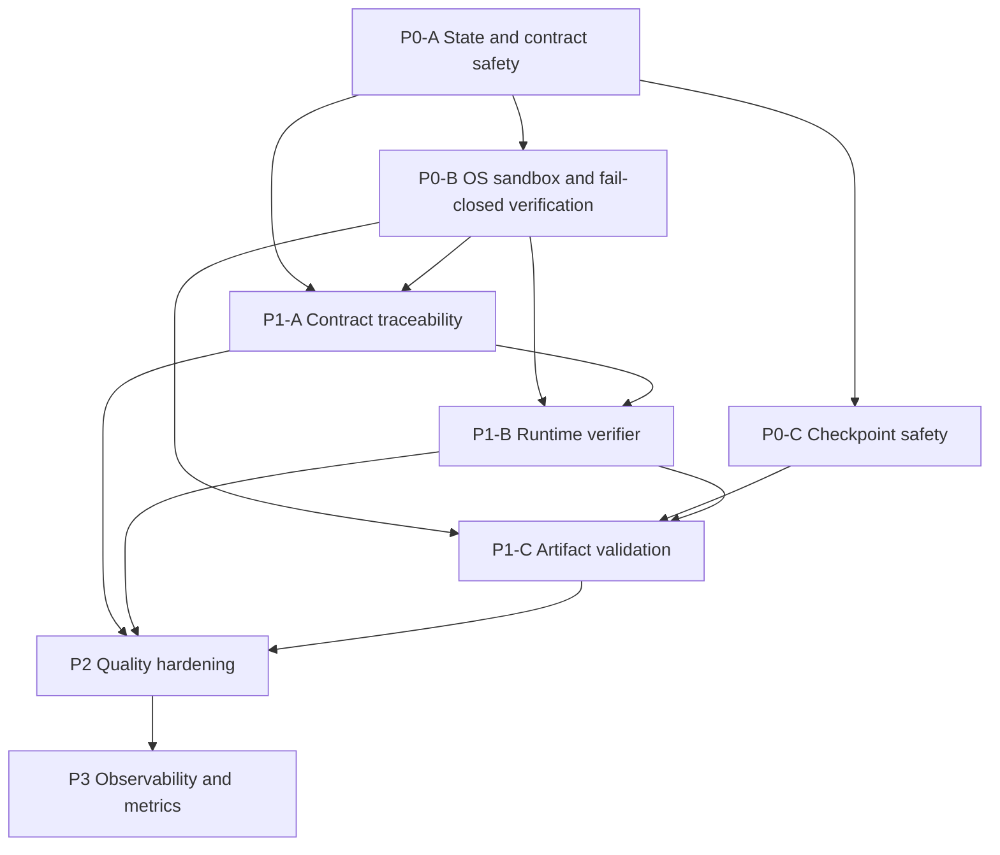

# Quality Pipeline Master Execution Plan

> **For agentic workers:** REQUIRED SUB-SKILL: Use `subagent-driven-development` or `executing-plans` to implement one delivery unit at a time. Read `PROJECT-CONTINUITY.md` first. Never execute a later unit before its dependencies are verified.

**Goal:** Implement `PROJECT-QUALITY-IMPROVEMENT-PLAN.md` without losing state across chats and without allowing unverified project completion.

**Architecture:** Eight delivery units establish state safety first, then OS-isolated executable verification, safe checkpoint reuse, requirement traceability, runtime behavior verification, artifact verification, hardening, and observability. Git-tracked continuity/evidence records are authoritative; agent memory and self-reports are not.

**Tech Stack:** Node.js ESM, Express, SQLite `node:sqlite`, existing React/Vite dashboard, OS sandbox adapters, project test harness.

## Global Constraints

- Do not repair `projects/project-f2226560-c4b5-4147-a7b5-aeb9f7df95fb`.
- Implement only one delivery unit at a time.
- Use TDD for every observable contract change.
- No direct project `completed` write outside the state projector.
- No mandatory verification gate may treat `SKIPPED`, `BLOCKED`, missing runner, or missing evidence as PASS.
- LLM output is advisory; only machine evidence can satisfy quality policy.
- Generated code never runs with host application authority.
- Every task ends with task-specific verification, independent review, evidence update, continuity validation, and commit.
- Every database test uses an isolated temporary `DB_PATH`; tests never read or mutate `backend/data/projects.db`.
- Unexpected workspace changes belong to the user; preserve them.

## Isolated Database Test Contract

P0-A Task 1 creates `backend/tests/isolatedDb.js` with `setupIsolatedTestDb(testName)`. Every later unit consumes this helper. Before the first dynamic import of `backend/db.js`, a database test must set `process.env.DB_PATH = isolated.dbPath`, register the opened DB, and call `await isolated.cleanup()` after the harness finishes. Each test command runs in its own Node process. Any unit-plan snippet showing a direct/static `db.js` import is shorthand and must be implemented with this isolation sequence; `backend/data/projects.db` is forbidden in all tests.

## Baseline

- Pre-ledger commit: `4164592f6a633f6094ff7fe45b4662c6bdbd835e`
- Approved improvement plan SHA-256: `b6ca1549990034bdd391ac89eebd7677522d13fc6f9192a5ad24c14d898f0db8`
- Continuity design: `docs/superpowers/specs/2026-08-27-session-continuity-design.md`

## Delivery Graph



## Shared Interfaces

These names are planning contracts. A unit that changes one must update dependent plans through explicit user-approved supersession.

```js
// Contract identity
{ projectId, contractId, contractRevision, contractHash }

// Gate result
{
  gateName,
  applicability: 'MANDATORY' | 'OPTIONAL' | 'NOT_APPLICABLE',
  status: 'PASS' | 'FAIL' | 'BLOCKED' | 'NOT_APPLICABLE',
  evidenceIds: [],
  policyVersion
}

// Verification aggregate
{
  runId, projectId, contractId, artifactId,
  status: 'queued' | 'running' | 'failed' | 'verified',
  gates: [], policyVersion
}

// Checkpoint identity
{
  projectId, taskId, contractId, planHash, taskSpecHash,
  inputHash, outputHash, gateVersion
}
```

## Migration and Schema Ownership

| Migration | Owner | Additive schema | Consumers |
| --- | --- | --- | --- |
| 7 `007_state_contract_safety` | P0-A | Minimal contract/requirement/element/task tables, repair issues, coarse-safe `task_checkpoints` | P0-C, P1-A |
| 8 `008_verification_evidence` | P0-B | Verification runs/checks and immutable command evidence | P1-A, P1-B, P1-C, P2, P3 |
| 9 `009_contract_traceability_artifacts` | P1-A | Typed requirement links, artifacts, immutable artifact files, required composite keys/indexes | P1-B, P1-C, P2, P3 |

P0-C, P1-B, and P1-C consume these schemas and must not reuse migrations 7–9. Any later additive schema starts at version 10 and requires master-plan supersession before a unit plan claims ownership.

## Unit Status

| Order | Unit | Plan | Evidence | Depends on | Status |
| ---: | --- | --- | --- | --- | --- |
| 1 | P0-A | `01-P0-A-state-contract-safety.md` | `../implementation-evidence/P0-A.md` | — | verified |
| 2 | P0-B | `02-P0-B-sandbox-verification.md` | `../implementation-evidence/P0-B.md` | P0-A | verified |
| 3 | P0-C | `03-P0-C-checkpoint-safety.md` | `../implementation-evidence/P0-C.md` | P0-A | verified |
| 4 | P1-A | `04-P1-A-contract-traceability.md` | `../implementation-evidence/P1-A.md` | P0-A, P0-B | verified |
| 5 | P1-B | `05-P1-B-runtime-verifier.md` | `../implementation-evidence/P1-B.md` | P0-B, P1-A | pending |
| 6 | P1-C | `06-P1-C-artifact-validation.md` | `../implementation-evidence/P1-C.md` | P0-B, P0-C, P1-B | pending |
| 7 | P2 | `07-P2-quality-hardening.md` | `../implementation-evidence/P2.md` | P1-A, P1-B, P1-C | pending |
| 8 | P3 | `08-P3-observability-metrics.md` | `../implementation-evidence/P3.md` | P2 | pending |

## Entry Gate for Every Unit

- [ ] Dependencies show `verified` evidence.
- [ ] Current unit matches `PROJECT-CONTINUITY.md` and `yol-haitasi-todo.md`.
- [ ] `node scripts/validate-continuity.mjs` passes.
- [ ] Worktree is reconciled and current plan hash matches.
- [ ] Relevant unit plan has no unresolved ambiguity.

## Exit Gate for Every Unit

- [ ] All mandatory plan tasks are checked.
- [ ] Task-specific and unit-level tests pass.
- [ ] Independent reviewer returns no blocking finding.
- [ ] Independent tester reproduces unit acceptance.
- [ ] Evidence receipt records commands, exit codes, commit, and findings.
- [ ] Continuity and roadmap agree.
- [ ] Validator passes.
- [ ] Unit status changes to `verified` in one coherent checkpoint.

## Execution Rule

Start only P0-A after explicit execution approval. Preparing these plans does not authorize source implementation.
