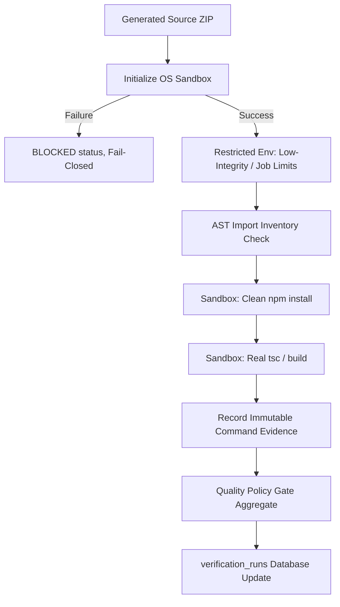

# P0-B: OS Sandbox and Fail-Closed Verification Plan

> **For agentic workers:** REQUIRED SUB-SKILL: Use `subagent-driven-development` or `executing-plans` to implement one delivery unit at a time. Read `PROJECT-CONTINUITY.md` first. Never execute a later unit before its dependencies are verified.

## Goal
Establish a secure, OS-enforced, unprivileged sandbox execution boundary for untrusted generated code, ensuring zero host contamination or privilege leaks. Replace heuristic-based build/test verification with deterministic compiler/typecheck execution inside the sandbox, and ensure all quality gates fail-closed without any LLM override capability or malformed agent approvals.

## Architecture
P0-B implements an independent, clean-room verification pipeline. Every generated-code command (install, typecheck, build, test run) executes within a secure OS-isolated container or restricted process sandbox. A strict "no-host-fallback" policy is enforced: if the secure sandbox adapter fails to initialize, all executable gates report `BLOCKED` and the project fails verification.



## Tech Stack
- **Node.js ESM** (`node:child_process`, `node:fs`, `node:crypto`)
- **OS Sandbox Adapters:**
  - **Windows:** Job Objects (using native process configuration / Windows API helper) and Restricted/Low-Integrity SIDs (using `icacls` and restricted access tokens).
  - **Portable (Linux/POSIX):** Docker or Bubblewrap isolation boundary.
- **AST Parsing:** `@babel/parser` / `acorn` for source package import discovery.
- **Database:** SQLite (`node:sqlite` database and migrations) for writing immutable verification checks.

## Global Constraints
1. **No Host Fallback:** Under no circumstances may code execution run with the host process's permissions or environment. Sandbox unavailability results in `BLOCKED` status.
2. **Fail-Closed:** Missing dependency registry access, registry timeouts, lock mismatches, compiler errors, or sandbox isolation faults immediately resolve to `FAIL` or `BLOCKED`.
3. **No LLM Overrides:** LLM Tester results are advisory and recorded only as narrative comments. A deterministic gate failure can never be approved by agent output.
4. **Coarse Invalidation:** Upon any verification failure/rejection, all task checkpoints for that contract revision must be invalidated.
5. **Database Version:** P0-B owns database schema Migration 8. All repository actions must target version 8.

---

## Shared Interfaces

### Consumed from P0-A:
1. **Contract Identity & Revision:**
   ```typescript
   interface ContractIdentity {
     projectId: string;
     contractId: string;
     contractRevision: number;
     contractHash: string;
   }
   ```
2. **Rejection State & Invalidation Hooks:**
   - `stateMachine.transitionToVerificationFailed(projectId, runId, issues)`
   - `checkpoints.invalidateAllCheckpoints(projectId, contractRevision)`
3. **Legacy Migrations:** Baseline database schema version 7 (defined in P0-A plan).

### Produced for P1-B & P1-C:
1. **Sandbox Execution Adapter:**
   ```javascript
   // backend/verification/sandboxRunner.js
   export async function executeInSandbox(command, args, options = {}) {
     // Returns: Promise<{ passed: boolean, exitCode: number, stdout: string, stderr: string, timedOut: boolean, aborted: boolean }>
   }
   ```
2. **Package Verifier:**
   ```javascript
   // backend/verification/packageVerifier.js
   export async function verifyDependencies(projectDir, contract) {
     // Returns: Promise<{ passed: boolean, checks: Array<{ name: string, status: 'passed'|'failed'|'blocked'|'skipped', reason?: string }> }>
   }
   ```
3. **Build Verifier:**
   ```javascript
   // backend/verification/buildVerifier.js
   export async function verifyBuild(projectDir, contract) {
     // Returns: Promise<{ passed: boolean, checks: Array<{ name: string, status: 'passed'|'failed'|'blocked'|'skipped' }> }>
   }
   ```

---

## Database Migration: Schema Version 8

P0-B introduces **Migration 8** (`008_verification_runs_and_checks`) in `backend/db.js` to create the verification run and check tables.

```sql
-- Upwards Migration 8
CREATE TABLE IF NOT EXISTS verification_runs (
    id TEXT PRIMARY KEY,
    project_id TEXT NOT NULL,
    contract_id TEXT NOT NULL,
    status TEXT NOT NULL CHECK(status IN ('queued', 'running', 'failed', 'verified', 'rejected', 'blocked')),
    policy_version TEXT NOT NULL,
    started_at DATETIME NOT NULL,
    ended_at DATETIME,
    UNIQUE(contract_id, id),
    FOREIGN KEY(project_id, contract_id)
      REFERENCES project_contracts(project_id, id) ON DELETE CASCADE
);

CREATE TABLE IF NOT EXISTS verification_checks (
    id TEXT PRIMARY KEY,
    contract_id TEXT NOT NULL,
    run_id TEXT NOT NULL,
    gate_name TEXT NOT NULL,
    applicability TEXT NOT NULL CHECK(applicability IN ('MANDATORY', 'OPTIONAL', 'NOT_APPLICABLE')),
    status TEXT NOT NULL CHECK(status IN ('PASS', 'FAIL', 'BLOCKED', 'NOT_APPLICABLE')),
    command TEXT,
    cwd TEXT,
    exit_code INTEGER,
    started_at DATETIME NOT NULL,
    ended_at DATETIME,
    timed_out INTEGER NOT NULL DEFAULT 0 CHECK(timed_out IN (0, 1)),
    stdout_digest TEXT,
    stderr_digest TEXT,
    evidence_json TEXT,
    UNIQUE(contract_id, id),
    FOREIGN KEY(contract_id, run_id)
      REFERENCES verification_runs(contract_id, id) ON DELETE CASCADE
);
```

### Forward-Recovery Rule

Migration 8 is additive and irreversible once any verification evidence exists. Test fixtures may drop their disposable databases, but production recovery must never drop `verification_runs` or `verification_checks`. A code rollback leaves both tables and their immutable rows intact; unavailable verifier code makes mandatory gates `BLOCKED`.

---

## Tasks (Explicit TDD Steps)

### Task 1: OS Sandbox Boundary Interface and Adapter Registry
- **Goal:** Implement the sandbox runner interface with specific adapters for Windows (Job Objects + Low Integrity SIDs) and Portable (Docker/Bubblewrap), enforcing the "no-host-fallback" contract.
- **Exact Files:**
  - Create: `backend/verification/sandboxRunner.js`
  - Create: `backend/verification/adapters/windowsSandbox.js`
  - Create: `backend/verification/adapters/portableSandbox.js`
  - Create: `backend/tests/test_sandbox_adapters.js`
  - Create: `backend/tests/test_sandbox_security.js`
  - Modify: `backend/engine/buildValidator.js` (redirection hook)
- **Interfaces:**
  - Produces `executeInSandbox(command, args, options)`

- [ ] **Step 1: Write the failing adapter-routing tests**
  Create `backend/tests/test_sandbox_adapters.js`. Inject an explicit fixture adapter; never let the unit test execute a host child process:
  ```javascript
  import assert from 'assert';
  import { executeInSandbox } from '../verification/sandboxRunner.js';

  const calls = [];
  const fixtureAdapter = {
    id: 'fixture',
    async execute(request) {
      calls.push(request);
      return { status: 'PASS', passed: true, exitCode: 0, stdout: 'hello', stderr: '' };
    }
  };
  const result = await executeInSandbox('node', ['-e', 'console.log(\"hello\")'], {
    adapter: fixtureAdapter,
    workspace: 'test-workspace'
  });
  assert.strictEqual(result.status, 'PASS');
  assert.strictEqual(calls.length, 1);
  await assert.rejects(
    executeInSandbox('node', ['-e', '0'], { adapter: null, workspace: 'test-workspace' }),
    error => error.code === 'SANDBOX_UNAVAILABLE'
  );
  ```
  Create `backend/tests/test_sandbox_security.js` as a real adapter integration fixture. It requires explicit `XFACTOR_TEST_SANDBOX_ADAPTER=windows|bubblewrap|docker`, provisions a disposable workspace, then attempts host-file writes, parent-environment reads, external network access, process-count exhaustion, and timeout escape. If the named adapter cannot initialize, the result must be `BLOCKED`; the test must never fall back to host execution.

- [ ] **Step 2: Run tests to verify RED**
  Run: `node backend/tests/test_sandbox_adapters.js`
  Expected: FAIL with `Error: Cannot find module '../verification/sandboxRunner.js'`.
  Run the real fixture only on a configured sandbox runner:
  `XFACTOR_TEST_SANDBOX_ADAPTER=<adapter> node backend/tests/test_sandbox_security.js`
  Expected: FAIL because the selected adapter implementation does not exist.

- [ ] **Step 3: Write minimal implementation**
  Create `sandboxRunner.js` with explicit adapter injection/registry and `SandboxInitializationError`. Adapters are selected only from approved configuration; no `process.platform` branch may silently execute the command on the host.
  - `windowsSandbox.js`: restricted token plus Job Object/process limits and allowlisted workspace ACL.
  - `portableSandbox.js`: bubblewrap/container mapping with read-only mounts, isolated writable workspace, and configured network policy.
  - Scrub sensitive environment before adapter invocation.
  - Return `BLOCKED`/throw `SANDBOX_UNAVAILABLE` when no approved adapter can initialize.

- [ ] **Step 4: Run tests to verify GREEN**
  Run: `node backend/tests/test_sandbox_adapters.js`
  Expected: PASS for injected routing and fail-closed unavailable-adapter assertions.
  Run: `XFACTOR_TEST_SANDBOX_ADAPTER=<adapter> node backend/tests/test_sandbox_security.js`
  Expected: PASS only when the real adapter blocks every escape fixture and cleans the workspace/process tree.

- [ ] **Step 5: Record evidence and validate continuity**
  Update `implementation-evidence/P0-B.md` with Task 1 sandbox boundary implementation and security tests success.
  Run: `node scripts/validate-continuity.mjs`
  Expected: PASS

- [ ] **Step 6: Commit**
  ```bash
  git add backend/verification/sandboxRunner.js backend/verification/adapters/windowsSandbox.js backend/verification/adapters/portableSandbox.js backend/tests/test_sandbox_adapters.js backend/tests/test_sandbox_security.js backend/engine/buildValidator.js
  git commit -m "feat(verification): implement secure OS-enforced sandbox boundary with no-host fallback"
  ```

---

### Task 2: Migration 8 for Verification Runs/Checks Schema and Repository
- **Goal:** Declare and apply Schema Migration 8 adding `verification_runs` and `verification_checks` tables, and implement the repository to persist verification run states.
- **Exact Files:**
  - Create: `backend/repositories/verificationRepository.js`
  - Create: `backend/tests/test_p0_b_migrations.js`
  - Modify: `backend/db.js` (apply Migration 8)
- **Interfaces:**
  - Consumes: `db` from `backend/db.js`
  - Produces: `verificationRepository` CRUD functions (`createRun`, `startCheck`, `endCheck`, `getRunEvidence`).

- [ ] **Step 1: Write the failing test**
  Create `backend/tests/test_p0_b_migrations.js`:
  ```javascript
  import assert from 'assert';
  import { getSchemaVersion, db } from '../db.js';
  import { createRun } from '../repositories/verificationRepository.js';

  const version = getSchemaVersion();
  assert.strictEqual(version, 8, `Schema version should be 8, got: ${version}`);

  const tables = db.prepare("SELECT name FROM sqlite_master WHERE type='table'").all().map(t => t.name);
  assert.ok(tables.includes('verification_runs'), 'verification_runs table missing');
  assert.ok(tables.includes('verification_checks'), 'verification_checks table missing');

  // Verification evidence cannot cross project/contract ownership.
  db.prepare("INSERT INTO projects (id, title, status) VALUES ('run-owner-a', 'A', 'planning'), ('run-owner-b', 'B', 'planning')").run();
  db.prepare(`
      INSERT INTO project_contracts (
          id, project_id, revision, status, contract_json, contract_hash
      ) VALUES ('run-contract-a', 'run-owner-a', 1, 'approved', '{}', 'hash-a')
  `).run();
  assert.throws(() => createRun({
      id: 'cross-owner-run',
      projectId: 'run-owner-b',
      contractId: 'run-contract-a',
      status: 'queued',
      policyVersion: '1',
      startedAt: new Date().toISOString()
  }), /FOREIGN KEY/);
  db.prepare("DELETE FROM projects WHERE id IN ('run-owner-a', 'run-owner-b')").run();
  ```

- [ ] **Step 2: Run test to verify it fails**
  Run: `node backend/tests/test_p0_b_migrations.js`
  Expected: FAIL with `AssertionError [ERR_ASSERTION]: Schema version should be 8, got: 7`

- [ ] **Step 3: Write minimal implementation**
  Add Migration 8 definition to `MIGRATIONS` in `backend/db.js`:
  ```javascript
  {
      version: 8,
      name: '008_verification_runs_and_checks',
      up: (database) => {
          database.exec(`
              CREATE TABLE IF NOT EXISTS verification_runs (...);
              CREATE TABLE IF NOT EXISTS verification_checks (...);
          `);
      }
  }
  ```
  Create `backend/repositories/verificationRepository.js` writing prepare statement queries for run lifecycle management using `node:sqlite`.

- [ ] **Step 4: Run test to verify it passes**
  Run: `node backend/tests/test_p0_b_migrations.js`
  Expected: PASS

- [ ] **Step 5: Record evidence and validate continuity**
  Update `implementation-evidence/P0-B.md` with Task 2 database migration success.
  Run: `node scripts/validate-continuity.mjs`
  Expected: PASS

- [ ] **Step 6: Commit**
  ```bash
  git add backend/db.js backend/repositories/verificationRepository.js backend/tests/test_p0_b_migrations.js
  git commit -m "migration: add verification runs and checks repository schema"
  ```

---

### Task 3: AST Dependency Inventory and Package Verifier
- **Goal:** Scan imports in source files via AST tree parsing, enforce allowed dependencies and package locks, and clean-install npm dependencies.
- **Exact Files:**
  - Create: `backend/verification/packageVerifier.js`
  - Create: `backend/tests/test_package_verifier.js`
- **Interfaces:**
  - Produces: `verifyDependencies(projectDir, contract)`

- [ ] **Step 1: Write the failing test**
  Create `backend/tests/test_package_verifier.js` writing temporary code files containing nested ESM and CJS imports, and testing the resolver:
  ```javascript
  import assert from 'assert';
  import { verifyDependencies } from '../verification/packageVerifier.js';

  const result = await verifyDependencies('./mock-dir', { requirements: [] });
  assert.ok(result.passed === false);
  ```

- [ ] **Step 2: Run test to verify it fails**
  Run: `node backend/tests/test_package_verifier.js`
  Expected: FAIL with `Error: Cannot find module '../verification/packageVerifier.js'`

- [ ] **Step 3: Write minimal implementation**
  Create `backend/verification/packageVerifier.js`. Load `@babel/parser` to traverse JS/TS code files. Parse import trees to collect package names. Match names against project package.json and verify version constraint integrity. If a lockfile is missing, return `FAIL`. Run `npm ci` inside `executeInSandbox` and record execution evidence.

- [ ] **Step 4: Run test to verify it passes**
  Run: `node backend/tests/test_package_verifier.js`
  Expected: PASS

- [ ] **Step 5: Record evidence and validate continuity**
  Update `implementation-evidence/P0-B.md` with Task 3 AST analysis and package verification success.
  Run: `node scripts/validate-continuity.mjs`
  Expected: PASS

- [ ] **Step 6: Commit**
  ```bash
  git add backend/verification/packageVerifier.js backend/tests/test_package_verifier.js
  git commit -m "feat(verification): implement AST import inventory and clean install verifier"
  ```

---

### Task 4: Real Compiler, Typecheck, and Build Gates
- **Goal:** Replace static conditional regex checks in `buildValidator.js` with active compilers running inside the sandboxed environment.
- **Exact Files:**
  - Create: `backend/verification/buildVerifier.js`
  - Create: `backend/tests/test_build_verifier.js`
  - Modify: `backend/engine/buildValidator.js` (refactor framework build to delegate)
- **Interfaces:**
  - Produces: `verifyBuild(projectDir, contract)`

- [ ] **Step 1: Write the failing test**
  Create `backend/tests/test_build_verifier.js` preparing a dummy project folder without node_modules. Assert build gate yields `BLOCKED` instead of passing.
  ```javascript
  import assert from 'assert';
  import { verifyBuild } from '../verification/buildVerifier.js';

  const res = await verifyBuild('./mock-no-modules', {});
  assert.strictEqual(res.checks.find(c => c.name === 'framework_build').status, 'blocked');
  ```

- [ ] **Step 2: Run test to verify it fails**
  Run: `node backend/tests/test_build_verifier.js`
  Expected: FAIL with `Error: Cannot find module '../verification/buildVerifier.js'`

- [ ] **Step 3: Write minimal implementation**
  Create `backend/verification/buildVerifier.js`. Modify `buildValidator.js` to dispatch execution commands (`tsc --noEmit`, `npm run build`, `prisma validate`) through the `sandboxRunner`. Disallow passing gates when `node_modules` is absent (maps to `BLOCKED`). Log command run parameters and stdout/stderr hashes into the verification database.

- [ ] **Step 4: Run test to verify it passes**
  Run: `node backend/tests/test_build_verifier.js`
  Expected: PASS

- [ ] **Step 5: Record evidence and validate continuity**
  Update `implementation-evidence/P0-B.md` with Task 4 compiler and build verification success.
  Run: `node scripts/validate-continuity.mjs`
  Expected: PASS

- [ ] **Step 6: Commit**
  ```bash
  git add backend/verification/buildVerifier.js backend/engine/buildValidator.js backend/tests/test_build_verifier.js
  git commit -m "feat(verification): add sandboxed framework compilation and typescript typecheck verifier"
  ```

---

### Task 5: Aggregate Quality Policy and Workflow Integration
- **Goal:** Make deterministic gate aggregation the sole acceptance authority, eliminate default/LLM approval, and keep `completed` unreachable until P1-C verifies an exact artifact.
- **Exact Files:**
  - Create: `backend/verification/qualityPolicy.js`
  - Create: `backend/tests/test_quality_policy_integration.js`
  - Modify: `backend/engine/workflow.js`
  - Modify: `backend/agents/tester.js`
- **Interfaces:**
  - Consumes: P0-A state transitions and coarse checkpoint invalidation; P0-B `verificationRepository`.
  - Produces: `evaluateVerificationRun(run)` returning `{ status: 'PASS'|'FAIL'|'BLOCKED', gates }`.
  - Does **not** produce a completed transition. Missing runtime/artifact gates remain `BLOCKED`; P1-B/P1-C later satisfy them.

- [ ] **Step 1: Write the failing test**
  Create `backend/tests/test_quality_policy_integration.js`. Simulate a mandatory build failure plus LLM `approved: true`; assert aggregate FAIL, project `verification_failed`, rejected attempt, and coarse checkpoint invalidation. Add a second case where build/type gates pass but runtime/artifact gates are absent; assert `BLOCKED`, never completed.
  ```javascript
  const failed = evaluateVerificationRun({
    agentApproved: true,
    gates: [{ gateName: 'build', applicability: 'MANDATORY', status: 'FAIL' }]
  });
  assert.strictEqual(failed.status, 'FAIL');

  const incomplete = evaluateVerificationRun({
    gates: [
      { gateName: 'typecheck', applicability: 'MANDATORY', status: 'PASS' },
      { gateName: 'build', applicability: 'MANDATORY', status: 'PASS' }
    ]
  });
  assert.strictEqual(incomplete.status, 'BLOCKED');
  ```

- [ ] **Step 2: Run test to verify RED**
  Run: `node backend/tests/test_quality_policy_integration.js`
  Expected: FAIL with `Error: Cannot find module '../verification/qualityPolicy.js'`.

- [ ] **Step 3: Write minimal implementation**
  Implement mandatory-gate policy in `qualityPolicy.js`. Remove malformed Tester default approval and every LLM override from `workflow.js`; persist advisory Tester text separately. On FAIL, set workflow attempt `rejected`, project `verification_failed`, persist repair issues, and call P0-A coarse invalidation. On missing mandatory evidence, persist `BLOCKED` and leave completion unreachable. Do not add a public `artifact_verified -> completed` edge.

- [ ] **Step 4: Run test to verify GREEN**
  Run: `node backend/tests/test_quality_policy_integration.js`
  Expected: PASS for LLM-override rejection, missing-evidence BLOCKED behavior, rejected attempt semantics, and checkpoint invalidation.

- [ ] **Step 5: Record evidence and validate continuity**
  Update `implementation-evidence/P0-B.md` with Task 5 command, exit code, aggregate cases, and commit.
  Run: `node scripts/validate-continuity.mjs`
  Expected: PASS.

- [ ] **Step 6: Commit**
  ```bash
  git add backend/verification/qualityPolicy.js backend/tests/test_quality_policy_integration.js backend/engine/workflow.js backend/agents/tester.js
  git commit -m "feat(verification): enforce fail-closed quality aggregation"
  ```

---

## Unit Exit Gate

- [ ] Run every P0-B task-specific test and the affected backend integration suites.
- [ ] Confirm Migration 8 tables creation, sandbox boundary isolation enforcement, low-integrity Windows/POSIX adapters, AST import scanning, clean npm installs, real framework typechecks/builds, and LLM override removal.
- [ ] Obtain independent reviewer approval and independent tester reproduction.
- [ ] Record exact commands, exit codes, commit, and decisions in `implementation-evidence/P0-B.md`; set `status: verified` only after all mandatory evidence passes.
- [ ] Mark P0-B verified in `implementation-plans/00-MASTER-EXECUTION-PLAN.md` and `yol-haitasi-todo.md`; advance `PROJECT-CONTINUITY.md` only after the evidence receipt exists.
- [ ] Run `node scripts/validate-continuity.mjs`.
- [ ] Commit source, tests, evidence, plans, roadmap, and continuity as one logical checkpoint.

---

## Verification and Rollback Plan

### Verification Gate Checklist
- Run `node backend/tests/test_sandbox_adapters.js` to assert platform sandbox execution.
- Run `node backend/tests/test_sandbox_security.js` to assert escape isolation and resource bounds.
- Run `node backend/tests/test_p0_b_migrations.js` to verify Schema Migration 8.
- Run `node backend/tests/test_package_verifier.js` to check import scanning and npm clean installs.
- Run `node backend/tests/test_build_verifier.js` to check real sandboxed compiler validations.
- Run `node backend/tests/test_quality_policy_integration.js` to assert aggregate policies and LLM override elimination.
- Verify `node scripts/validate-continuity.mjs` executes and passes.

### Forward Recovery / Code Rollback

If a sandbox adapter causes execution lockouts:
1. Stop new verification runs and mark executable gates `BLOCKED`.
2. Preserve and back up Migration 8 tables; never downgrade to v7 or delete evidence rows.
3. Revert application code to the last compatible commit while retaining the additive schema.
4. Configure another approved OS-enforced adapter (for example portable container instead of native Windows adapter), rerun isolation tests, then resume new runs.
5. No recovery path may enable host fallback or rewrite prior evidence.
